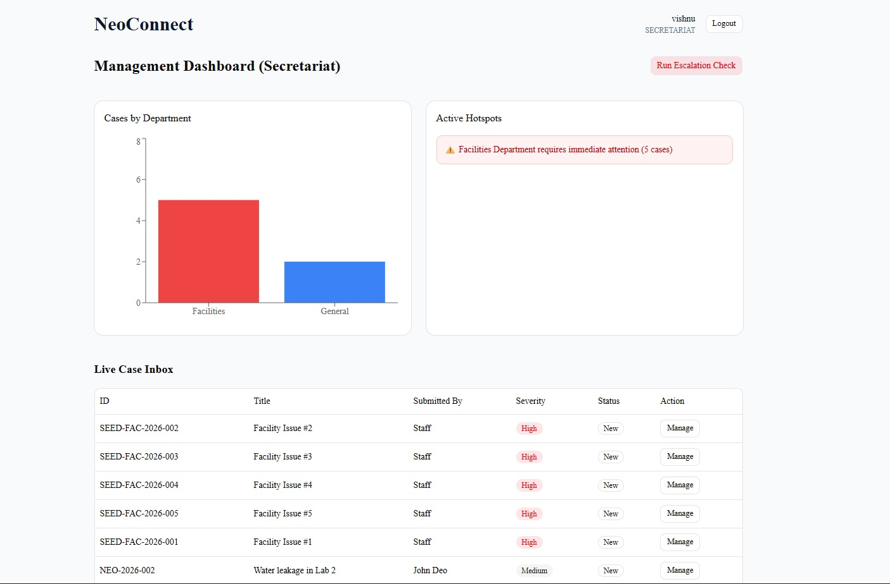
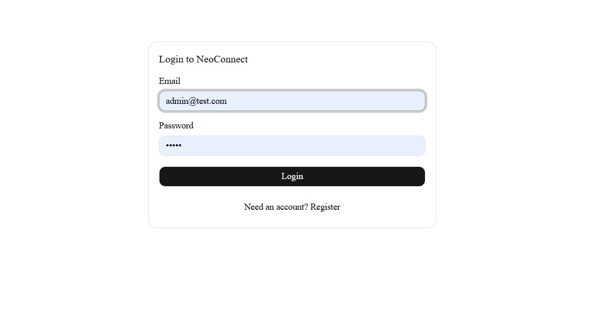

# 🏛️ NeoConnect - Frontend Portal

### 🔗 [Live Application Link](https://neo-connect-mern-system-4bwwtjzoq.vercel.app/)

This repository contains the client-side code for NeoConnect, an internal grievance and feedback system.

**NeoConnect** is a comprehensive full-stack solution designed for educational institutions to bridge the gap between staff and management. It streamlines the grievance process with automated tracking, institutional polling, and data-driven analytics.
---

## 📸 App Preview

### Management Dashboard & Analytics

*Real-time departmental analytics with automated red-flagging for hotspots.*

### Staff Submission Portal

*User-friendly submission form with anonymous reporting options.*

### Secure Authentication

*Role-based access control for Staff, Secretariat, and Case Managers.*
---

## 🚀 Key Frontend Features
* **Role-Based Dashboards:** Distinct views for Staff and Management using Next.js Middleware.
* **Interactive Analytics:** Real-time data visualization using **Recharts**.
* **Responsive UI:** Built with **Tailwind CSS** and **Shadcn UI** for a professional look.
* **State Management:** Client-side logic for handling automated tracking IDs and polling.

## 🛠️ Tech Stack
* **Framework:** Next.js 14 (App Router)
* **Styling:** Tailwind CSS
* **Components:** Shadcn UI
* **Icons:** Lucide React

## 🔐 Test Credentials

To explore the different role-based dashboards without registering multiple accounts, you can use these pre-configured credentials:

| Role | Email | Password | Access Level |
| :--- | :--- | :--- | :--- |
| **Admin/Secretariat** | `admin@test.com` | `admin` | Full Analytics, Case Management, Hotspot Tracking |
| **Staff** | (Register a new account) | (Your choice) | Case Submission, Anonymous Reporting, Polling |

> **Note:** New registrations default to the **Staff** role to ensure system security.

## ⚙️ Setup Instructions
1. `npm install`
2. Create `.env.local` with `NEXT_PUBLIC_API_URL=https://neoconnect-api.onrender.com`
3. `npm run dev`